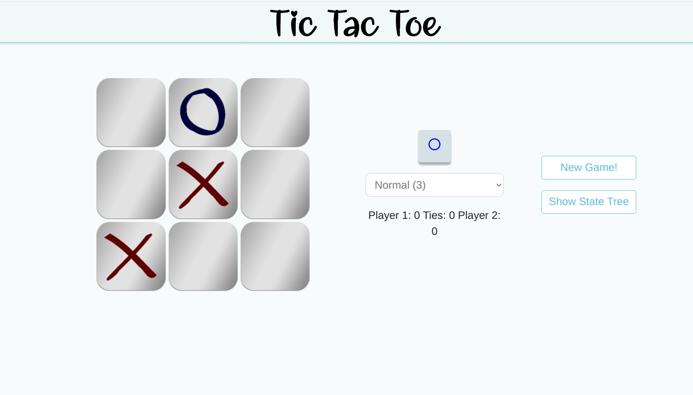
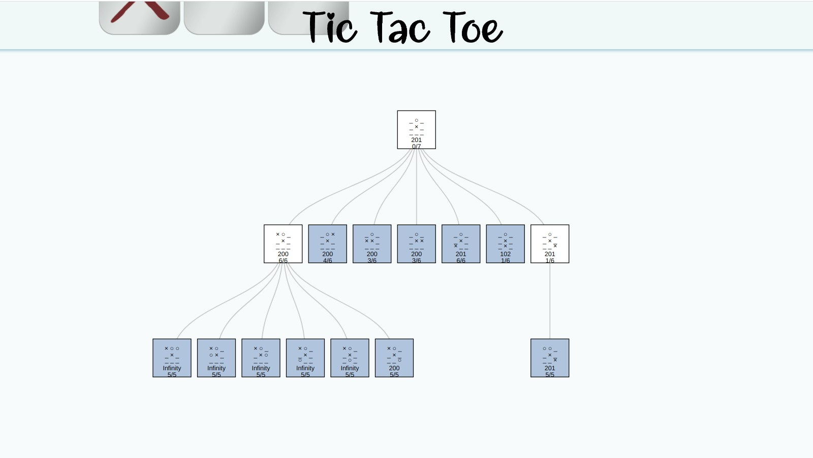
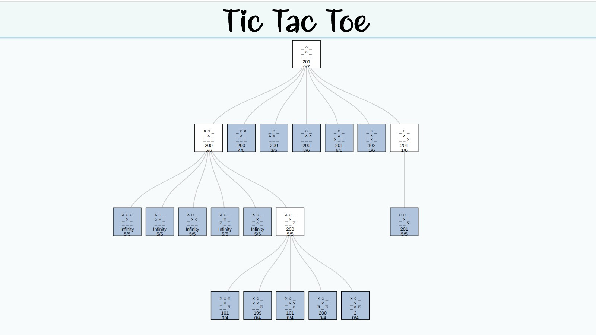

# Tic-Tac-Toe Game

This project is an implementation of the classic Tic-tac-toe (noughts and crosses) game written on **Object-oriented JavaScript**.

The *minimax* algorithm with *alpha-beta pruning* is used to create the computer opponent the user can play against. This algorithm is extended to *iterative deepening strategy*, so the user can control the depth of the opponent search tree by changing the difficulty of the game.

The aim of this project was to create an environment to study the behaviour of the computer opponent using the algorithm mentioned above by observing its search tree during the game.

### How to Launch
After downloading the project run the* index.html* file in your browser to launch the game.

### Game Interface
The interface of the game is shown in the pictures below. The search tree of the computer opponent can be expanded by the user anytime during the game.

